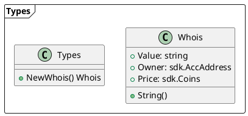
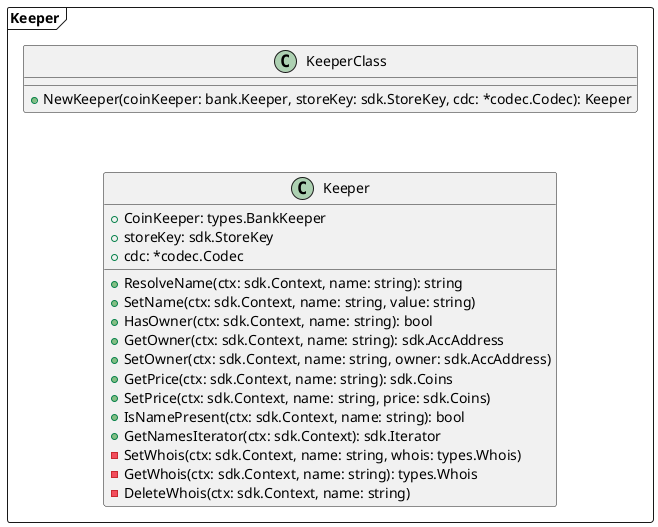
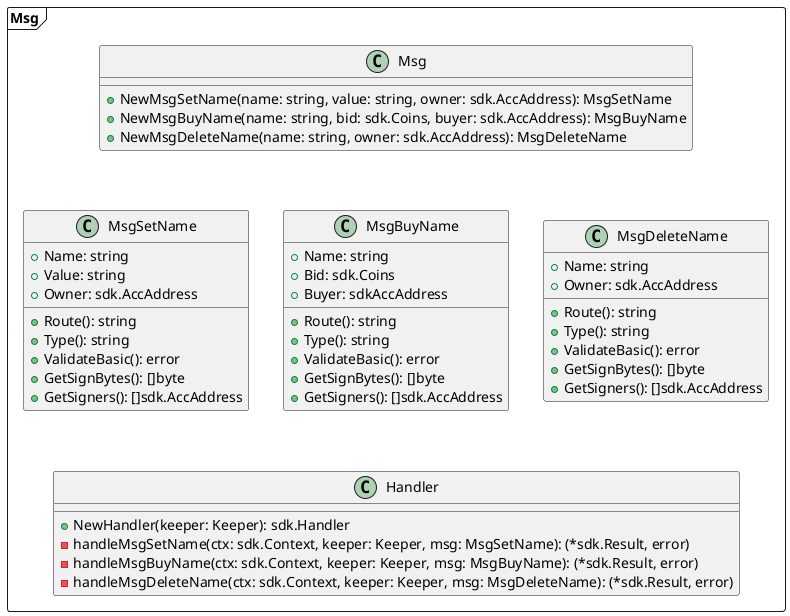
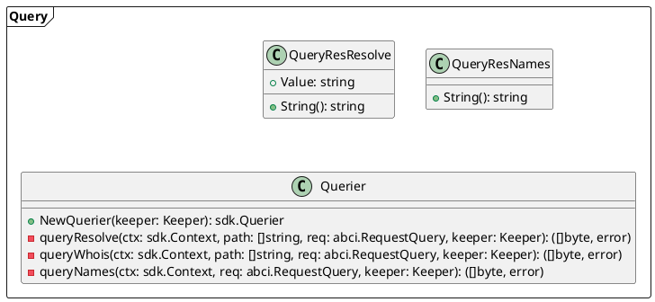
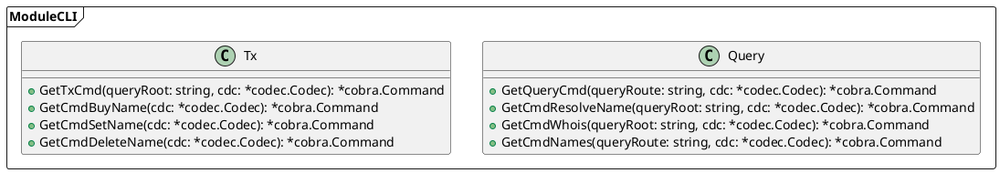
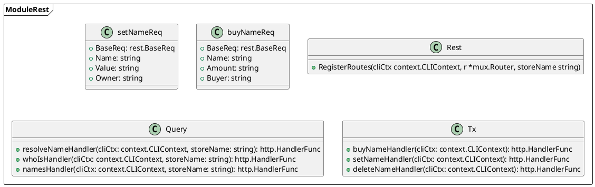
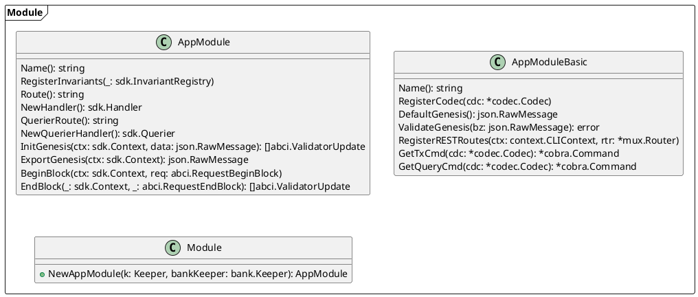

- Module
    - Types
        - ./x/nameservice/types/types.go
    - Key
        - ./x/nameservice/types/key.go
    - Errors
        - ./x/nameservice/types/errors.go
    - Expected Keepers
        - ./x/nameservice/types/expected_keepers.go
    - Keeper
        - ./x/nameservice/keeper/keeper.go
    - Mesages and Handlers 
        - ./x/nameservice/types/msgs.go
        - ./x/nameservice/handler.go
    - Queries 
        - ./x/nameservice/types/querier.go
        - ./x/nameservice/keeper/querier.go
    - Alias
        - ./x/nameservice/alias.go
    - Codec File
        - ./x/nameservice/types/codec.go
    - Module CLI
        - ./x/nameservice/client/cli/query.go
        - ./x/nameservice/client/cli/tx.go
    - Rest Interface
        - ./x/nameservice/client/rest/rest.go
        - ./x/nameservice/client/rest/query.go
        - ./x/nameservice/client/rest/tx.go
    - AppModule Interface
        - ./x/nameservice/module.go
    - Genesis 
        - ./x/nameservice/genesis.go
        - ./x/nameservice/types/genesis.go
- Application
    - App
        - ./app/app.go
    - Entry Points
        - ./cmd/nsd/main.go
        - ./cmd/nscli/main.go


```bash
scaffold app lvl-1 [user] [repo] [flags]
```

```bash
scaffold module [user] [repo] nameservice
```






















